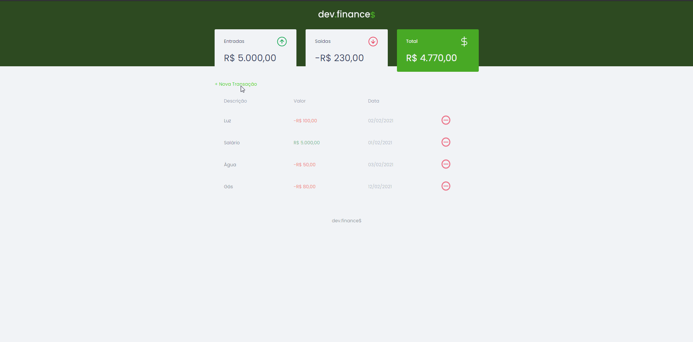

<h1 align="center">
    
<h1>

<h1>
    
<h1>

<h1 align = "center">
    <a href="https://www.linkedin.com/in/willian-ssouza/">
        
    </a>
    <a href="https://github.com/willian-souza/rocketseat-site/blob/master/LICENSE">
        
    </a>    
<h1>

# 📋 Índice
- [Sobre](#-sobre)
- [Tecnologias utilizadas](#-tecnologias-utilizadas)
- [Conhecimentos adquiridos](#-conhecimentos-adquiridos)
- [Como baixar o projeto](#-como-baixar-o-projeto)
- [Licença](#-licença)

---

# 📄 Sobre

O projeto **DevFinance$** é uma aplicação de controle financeiro, onde é possível cadastrar e excluir transações e ver o saldo de entrada e saída.<br>
Foi desenvolvido durante a **Maratona Discover** da **Rocketseat**.


--- 

# 🖥 Tecnologias utilizadas

- [HTML5](https://developer.mozilla.org/pt-BR/docs/Web/HTML/HTML5)
- [CSS3](https://developer.mozilla.org/pt-BR/docs/Archive/CSS3)
- [JavaScript](https://developer.mozilla.org/pt-BR/docs/Aprender/JavaScript)


---

# ✍ Conhecimentos adquiridos
- Utilização do LocalStorage para armazenamento dos dados
- Utilização de expressões regulares

---

# 📦 Como baixar o projeto

OBS: Para realizar os procedimentos abaixo é necessário ter o [Git](https://git-scm.com/downloads) instalado na máquina.

```bash

    # Clonar o repositório
    $ git clone https://github.com/willian-souza/devfinances

    # Entrar no diretório baixado
    $ cd devfinances

    # Executar a apliação
    Basta abrir o arquivo index.html em qualquer navegador        
     

```
---

# 📝Licença
Esse projeto está sob a licença MIT. Veja o arquivo [LICENSE](/LICENSE) para mais detalhes.

---

Desenvolvido por [Willian dos Santos Souza](https://www.linkedin.com/in/willian-ssouza/)
